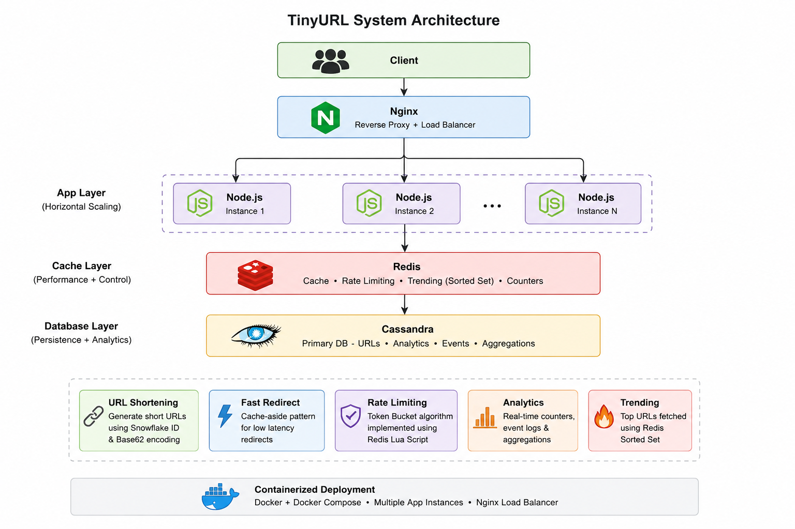

# 🚀 TinyURL - Distributed URL Shortener System (Production-Grade)

**Latest Release:** v2.0.0
👉 [View Release](https://github.com/AkashFullStackDev/tinyurl-system-design/releases/tag/v1.0.0)

A scalable, production-ready URL shortener built using distributed system principles (similar to Bitly/TinyURL).

---

## 🧩 Architecture Overview



## 🎯 Why This Project?

This project demonstrates real-world distributed system concepts:

* Horizontal scaling
* Distributed ID generation (Snowflake)
* Cache-aside pattern
* Rate limiting (Token Bucket - Redis Lua)
* Analytics system (event + aggregation)
* Load balancing (Nginx)
* Fault tolerance

---

## 📌 Features

### 🔗 Core

* URL shortening (long → short)
* Base62 encoding
* Snowflake ID generation

---

### ⚡ Performance

* Redis caching (fast redirects)
* Cache-aside strategy
* Low latency reads

---

### 🛡️ Reliability & Control

* Rate limiting (Token Bucket)
* Atomic implementation using Redis Lua
* IP-based throttling

---

### 📊 Analytics (SDE-2 Level)

* Real-time click count (Redis)
* Click event storage (Cassandra)
* Time-series design (partition by day)
* Last 24h analytics
* Counter table (O(1) reads)

---

### 🔥 Advanced Features

* Top Trending URLs (Redis Sorted Set)
* Expiring URLs (TTL + DB validation)
* Custom Alias support (vanity URLs)
* Atomic uniqueness using Cassandra LWT (`IF NOT EXISTS`)

---

## ⚖️ Trade-offs

* LWT used only for custom alias (slower but safe)
* Event + aggregate storage increases complexity
* Cache inconsistency handled via fallback
* No multi-region (yet)

---

## 🏗️ Architecture Components

| Layer     | Technology | Purpose                            |
| --------- | ---------- | ---------------------------------- |
| App       | Node.js    | API layer                          |
| Cache     | Redis      | caching + rate limiting + trending |
| DB        | Cassandra  | scalable storage                   |
| Proxy     | Nginx      | load balancing                     |
| Container | Docker     | deployment                         |

---

## 🔄 System Flow

### 🔹 URL Shortening

`POST /shorten`

1. Validate input
2. If custom alias → use Cassandra LWT (`IF NOT EXISTS`)
3. Else → generate Snowflake ID
4. Convert to Base62
5. Store in Cassandra
6. Cache in Redis

---

### 🔹 URL Redirection

`GET /redirect/:code`

1. Check Redis cache
2. If hit → return immediately
3. If miss → fetch from Cassandra
4. Check expiry
5. Cache result
6. Update analytics:

   * Redis counter
   * Trending (Sorted Set)
   * Cassandra event log
   * Counter table update
7. Redirect

---

### 🔹 Analytics

`GET /analytics/:code/*`

* Total clicks → Redis
* Recent clicks → Cassandra
* Last 24h → Counter table
* Trending → Redis Sorted Set

---

## 🧠 Database Design (Cassandra)

### urls

```sql
CREATE TABLE urls (
  short_code text PRIMARY KEY,
  long_url text,
  created_at timestamp,
  expires_at timestamp,
  user_id text,
  is_active boolean
);
```

---

### clicks_by_code_day (event table)

```sql
PRIMARY KEY ((short_code, day), event_time)
```

---

### clicks_count_by_code_day (counter table)

```sql
PRIMARY KEY (short_code, day)
```

---

## ⚡ Caching Strategy

* Cache-aside pattern
* Redis TTL for expiring URLs
* Sorted Set for ranking

---

## 🚀 Scalability

* Stateless app instances
* Horizontal scaling (Docker)
* Redis reduces DB load
* Cassandra handles high writes
* Nginx distributes traffic

---

## 🛡️ Failure Handling

| Failure             | Handling       |
| ------------------- | -------------- |
| App crash           | No data loss   |
| Redis down          | fallback to DB |
| Cassandra node down | replication    |
| Cache miss          | DB fallback    |

---

## 📈 System Strength

* High throughput writes
* Low latency reads
* Scalable analytics
* Production-ready patterns

---

## 🧠 Advanced Concepts Used

* Cache-aside pattern
* Event + aggregation model
* Distributed rate limiting
* Reverse proxy
* Load balancing
* Hot partition avoidance
* Atomic operations (Redis + Cassandra LWT)

---

## 🧪 API Endpoints

### Core

* `POST /shorten`
* `GET /redirect/:code`

---

### Analytics

* `GET /analytics/:code/total`
* `GET /analytics/:code/recent`
* `GET /analytics/:code/last24h`
* `GET /analytics/trending`

---

## 🛠️ Tech Stack

* Node.js (Express)
* Cassandra
* Redis
* Nginx
* Docker

---

## ▶️ Run the Project

```bash
docker-compose up --build --scale app=3
```

---

## 🔐 Security

* Env-based config
* No secrets in repo
* Backend not exposed directly (Nginx)

---

## 🚀 Future Improvements

* Multi-region deployment
* Kafka-based async analytics
* CDN integration
* User authentication
* Rate limiting at Nginx level

---

## 👨‍💻 Author

Akash Kumar
